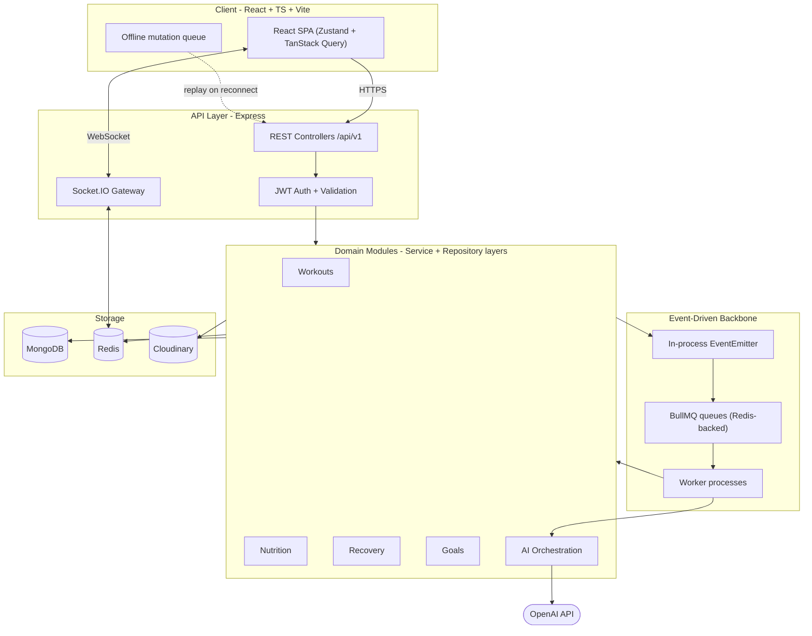

#Capstone Project
*Document 00 of the FitAI X Architecture & Research Series*

---

## About this series

FitAI X's spec asks for Problem → Research → Tradeoffs → System Design → Data Model → Algorithms → AI Design → API Design → Folder Structure → Scaling → Implementation Plan, for every one of 14 features. Three of those items — Folder Structure, Scaling, and the Implementation Roadmap — are whole-system decisions. Writing them fresh 14 times either contradicts itself as the project evolves or degenerates into copy-paste. So the series is split:

**Global documents (this category, produced once):**
- `00-foundations.md` — this document: service topology, event/queue backbone, data layer conventions, AI orchestration boundary, folder structure, MVP/production split
- `xx-scaling.md` — full 100 → 1M user story, written once feature-specific bottlenecks are known
- `xx-roadmap.md` — the 7-day milestone plan, written once effort estimates exist per feature

**Per-feature documents (one each, your exact template — Problem, Research, Tradeoffs, System Design, Data Model, Algorithms, AI Design, API Design, Implementation Notes, References):**

1. Adaptive Workout Engine
2. Workout Version Control
3. AI Memory Timeline
4. Dynamic Goal Engine
5. Progressive Overload Engine
6. Recovery Score
7. Injury Prediction
8. Dependency Graph
9. Grocery Optimizer
10. Real-Time Dashboard
11. Event-Driven Backend *(short doc — mostly covered here)*
12. Background Workers *(short doc — mostly covered here)*
13. Explainable AI
14. Offline Sync
15. AI Recommendation Engine

---

## 1. Problem

A CRUD fitness tracker stores what the user did. Its data model is simple — create workout, log sets, view history — because the user is the only writer, and every screen is a direct projection of stored rows.

FitAI X inverts this: the **system** is also a writer. It regenerates the workout, the nutrition plan, the recovery guidance, and the goals continuously, from signals the user never explicitly asked it to act on. That inversion is where the actual engineering difficulty lives — it cascades into five distinct problems:

1. **Decisions must be reproducible and inspectable, not just outcomes.** When the AI changes next week's program, "why did it change" has to be answerable weeks later — to the user, and to you while debugging. Decisions become durable records with their inputs attached, not throwaway function calls.
2. **State must be versioned, not just stored.** If a program can be regenerated automatically, you need to diff version N against N-1, roll back, and see what triggered the change — a git-like model applied to a consumer object.
3. **Regenerations can conflict with each other.** A hypertrophy program computed Monday and a recovery-driven deload triggered by Wednesday's bad sleep data are two independent writers touching the same entity. That's why "Conflict Detection" and "Version Control" are explicit items in your feature list, not nice-to-haves.
4. **The system runs on at least three clocks.** Real-time (dashboard, socket push), near-real-time (recovery score recompute right after a workout is logged), and batch/async (nightly goal re-evaluation, grocery optimization). A synchronous request/response backend can't serve all three without blocking the user or silently dropping work on crash.
5. **Two incompatible computation paradigms have to coexist.** Progressive overload math, recovery score formulas, and dependency-graph resolution are deterministic — same input, same output, cheap, instant. Coaching explanations and meal descriptions are generative — variable, metered, occasionally wrong. Mixing these without a hard boundary is the most common way "AI-powered" fitness apps end up inconsistent, expensive, and unexplainable.

Most consumer fitness apps struggle here because the AI was added after the data model existed: a rule table with no memory of its own past decisions, plus a chatbot bolted on top, rather than the AI being a real participant in the recommendation loop. Retrofitting versioning, an audit trail, and explainability onto a system not built for them is expensive — precisely the trap a 7-day MVP needs to avoid by getting the foundation right now.

## 2. Research

AI memory architecture in particular moves fast enough that anything more than a few months old is already dated, so this leans on current (2026) sources rather than general knowledge alone.

**Service topology.** The 2026 consensus across recent engineering write-ups has converged on a specific answer for a solo-builder, 7-day timeline: a **modular monolith**, not a "true" monolith and not microservices. A modular monolith is one deployable unit with strict internal boundaries — explicit interfaces between modules, no module reaching into another's database — which gets you most of microservices' clarity without service discovery, distributed tracing, or inter-service auth. The honest reasons to actually extract a module later are narrow: a module's compute profile diverges sharply from the rest, a second developer needs full independent ownership, or a hard compliance boundary appears — not "microservices are best practice." MVP → modular monolith → microservices is treated as a normal, expected progression, not a sign of under-planning.

**Job queues.** BullMQ's own production guide flags two operational details that are easy to get backwards on a first build: set Redis's `maxmemory-policy` to `noeviction` for any Redis instance backing a queue (otherwise Redis can silently evict job data the way it would evict a cache), and configure `Queue` connections to fail fast on disconnect while `Worker` connections retry indefinitely — reversing these either loses jobs or leaves workers unable to recover. Current BullMQ (5.x) also ships flow producers for DAG-style job dependencies, which map directly onto chains like "regenerate program → narrate via AI → recompute dependency graph."

**Real-time layer.** Socket.IO's own current guidance beyond a single instance is the Redis adapter — the sharded variant, built on Redis 7's sharded pub/sub, for new builds. One detail worth internalizing early: the adapter assumes Redis is trusted infrastructure, since events crossing it aren't signed or encrypted — Redis must never be reachable from an untrusted network. A recent write-up on this exact stack (Socket.IO + Redis adapter + JWT) argues for authenticating once at the WebSocket handshake rather than per event, and tracking each user's active connections in a Redis set so connection limits and stale sockets can be enforced across restarts.

**AI memory and context management.** This is the fastest-moving piece, and it maps directly onto "AI Memory Timeline." A recent survey on production agent memory (arXiv 2603.07670) collapses the field into three patterns: monolithic context (everything in the prompt — cheap, capacity-capped), context plus an external retrieval store (working memory in the context window, long-term records in a structured or vector store, pulled in on demand), and tiered memory with a learned controller (the pattern behind frameworks like MemGPT). The paper's own advice is to start with the middle pattern and graduate to the third only once evidence shows it's needed — which lines up with a 7-day MVP: a structured, queryable decision log plus a retrieval step before each AI call is enough; a self-managing multi-tier memory controller is not a week-one build.

**Explainability vs. traceability.** Worth separating explicitly, since your list has "Explainable AI" but also implicitly needs traceability for version control and audit requirements. Explainability answers "why did the system produce this" (the reasoning, in language); traceability answers "what exact inputs, model version, and config produced it" (the reconstruction). Different mechanisms satisfy each: explainability by capturing a natural-language rationale alongside the decision, traceability by logging deterministic inputs plus a version/config identifier — treating every prediction as a durable, inspectable event rather than a throwaway output.

**Offline sync.** Conflict-resolution strategy runs from last-write-wins (simplest, fits low-conflict domains) through rule-based merges to full CRDTs (best UX, highest cost). Fitness logging is genuinely low-conflict — the realistic collision is one user editing the same program from two devices, or the AI regenerating a program while an offline edit is queued — which argues for last-write-wins with a visible conflict flag over CRDTs at MVP stage.

**Versioning and audit.** The append-only event log (Microsoft's Azure Architecture Center has a clean reference) gives you audit trail, replay, and history "for free," but a fully event-sourced system — CQRS, projections, replay-to-derive-state everywhere — is a large commitment most of the app doesn't need. One well-argued reframe: treat it as "git for data" — apply the append-only, immutable-history *principle* only to the entities where "how did we get here" matters as much as "where are we now" (workout program versions, AI decisions), and leave the rest as ordinary mutable documents.

## 3. Tradeoffs

| Decision | Options considered | Chosen for FitAI X | Why |
|---|---|---|---|
| Service topology | Microservices / plain monolith / modular monolith | Modular monolith | Solo builder, 7-day clock — microservices' ops tax (service discovery, distributed tracing, inter-service auth) has no payoff at this scale. Modules are still cut along business-domain lines, so extraction later is weeks, not months, if a real need shows up. |
| Event backbone | Kafka or RabbitMQ / BullMQ+Redis only / plain EventEmitter only | EventEmitter (in-process) + BullMQ (durable) together | A dedicated broker like Kafka is overkill for MVP traffic and adds ops burden with no matching payoff. EventEmitter alone loses everything on crash — unacceptable for AI jobs that take seconds. The pair gives cheap same-process reactions and durable cross-process jobs without a third infrastructure piece. |
| Primary datastore | PostgreSQL / MongoDB | MongoDB (per your stack) | Workout programs, AI decisions, and nutrition plans are naturally nested, variably-shaped documents — a good fit. The cost to manage explicitly: referential integrity and graph-like queries (dependency graph) are enforced in application code, not by the database. |
| Real-time transport | SSE / long polling / Socket.IO | Socket.IO + Redis adapter from day one | Given, and correct regardless — later features (goal negotiation, live logging feedback) plausibly need bi-directional push. Wiring the adapter now costs a few lines; retrofitting it against live production traffic and sticky-session assumptions is a much bigger job. |
| Versioning strategy | Full event sourcing (CQRS + projections) / mutate-in-place + bolted-on audit log / append-only versioned docs for high-value entities only | Append-only versioning, applied selectively | Full event sourcing is a systemwide commitment most features don't need. Mutate-in-place-plus-audit-log is the retrofitting trap the Problem section describes. Selective append-only versioning gets audit trail, rollback, and explainability inputs where "how did we get here" actually matters, without the replay/projection tax everywhere else. |
| Offline conflict resolution | CRDTs / rule-based merge / last-write-wins + flag | Last-write-wins with a visible conflict flag | Fitness logging is low-conflict (mostly single editor at a time). CRDTs solve a collaborative-editing problem you don't have yet — building one in week one spends effort on the wrong risk. |

## 4. System Architecture

In one sentence: a modular-monolith Express API sits in front of domain modules that never call the OpenAI API directly — only the AI Orchestration module does. Anything synchronous and fast happens in the request/response cycle; anything slow, retryable, or scheduled goes through BullMQ to a worker pool. Socket.IO (Redis adapter wired from day one) pushes state changes to the client; the client keeps an offline mutation queue that replays on reconnect.

Module boundaries — Workouts, Nutrition, Recovery, Goals, Auth, AI Orchestration — each owns its own collections and exposes behavior only through its service interface. No module reaches into another's database directly; cross-module needs go through a service call or a domain event.



## 5. Folder Structure

Monorepo, npm/pnpm workspaces (skip Turborepo/Nx for the MVP — one more tool you don't need yet):

```
fitai-x/
├── apps/
│   ├── backend/
│   │   ├── src/
│   │   │   ├── modules/
│   │   │   │   ├── auth/
│   │   │   │   │   ├── auth.controller.ts
│   │   │   │   │   ├── auth.service.ts
│   │   │   │   │   ├── auth.repository.ts
│   │   │   │   │   └── auth.validators.ts
│   │   │   │   ├── workouts/
│   │   │   │   │   ├── workout.controller.ts
│   │   │   │   │   ├── workout.service.ts
│   │   │   │   │   ├── workout.repository.ts
│   │   │   │   │   ├── workout.model.ts
│   │   │   │   │   ├── workout.validators.ts
│   │   │   │   │   ├── workout.events.ts
│   │   │   │   │   └── workout.types.ts
│   │   │   │   ├── nutrition/          # same shape as workouts/
│   │   │   │   ├── recovery/           # same shape
│   │   │   │   ├── goals/              # same shape
│   │   │   │   └── ai-orchestration/
│   │   │   │       ├── ai.service.ts          # only module that imports the OpenAI client
│   │   │   │       ├── context-builder.ts     # assembles retrieval + working memory
│   │   │   │       ├── cost-tracker.ts
│   │   │   │       └── prompts/
│   │   │   │           ├── workout-narration.prompt.ts
│   │   │   │           └── goal-negotiation.prompt.ts
│   │   │   ├── events/
│   │   │   │   ├── event-bus.ts        # in-process EventEmitter wrapper
│   │   │   │   └── event-types.ts
│   │   │   ├── workers/
│   │   │   │   ├── queues/
│   │   │   │   │   ├── ai-generation.queue.ts
│   │   │   │   │   └── recompute.queue.ts
│   │   │   │   └── processors/
│   │   │   │       ├── ai-generation.processor.ts
│   │   │   │       └── recompute.processor.ts
│   │   │   ├── middleware/
│   │   │   │   ├── error-handler.ts    # centralized error handling
│   │   │   │   ├── validate.ts         # zod-based validation middleware
│   │   │   │   └── auth.middleware.ts
│   │   │   ├── sockets/
│   │   │   │   └── socket-gateway.ts
│   │   │   ├── config/
│   │   │   │   ├── db.ts
│   │   │   │   └── redis.ts
│   │   │   ├── routes/
│   │   │   │   └── v1/                 # API versioning lives at the route layer
│   │   │   └── app.ts
│   │   └── tests/
│   └── frontend/
│       └── src/
│           ├── features/               # mirrors backend modules 1:1
│           │   ├── workouts/
│           │   ├── nutrition/
│           │   ├── recovery/
│           │   └── goals/
│           ├── components/
│           ├── stores/                 # Zustand - includes offline mutation queue
│           ├── queries/                # TanStack Query hooks
│           ├── routes/                 # React Router
│           └── lib/
├── packages/
│   ├── shared-types/                   # DTOs shared FE/BE
│   ├── validators/                     # zod schemas, single source of truth
│   └── config/
└── docs/
    └── architecture/                    # this document series lives here
```

## 6. Data Layer Strategy (global conventions)

Detailed schemas belong in each feature's own Data Model section — these are the conventions every collection follows:

- Every mutable, user-facing collection gets `_id`, `userId`, `createdAt`, `updatedAt`, `deletedAt: Date | null` (soft delete — queries default-filter `deletedAt: null`).
- Entities that need version history (`workoutPrograms`, `aiDecisions`) additionally get: `entityId` (stable across versions), `version` (incrementing int), `parentVersion`, `createdBy: 'user' | 'ai' | 'system'`, and `reason` (short string — the explainability hook). "Current" is just the highest `version` for a given `entityId`; there's no separate current flag to keep in sync or drift out of.
- Indexes: a unique compound `{entityId, version}` on every versioned collection; `{userId, createdAt}` on every timeline-style collection (AI Memory Timeline, workout session logs).
- This is the same shape as the version control system you built in Go — a stable identifier plus an immutable, incrementing history — just applied to documents instead of files.

## 7. AI Orchestration Principle

The rule that keeps the AI layer explainable, cheap, and honest: **the LLM never decides a number.**

- Recovery score, overload increment, calorie targets — computed by plain TypeScript. Reproducible, free, instant, unit-testable.
- The LLM's job is narration and negotiation: explaining a deterministic decision in natural language, parsing ambiguous free-text goal input into structured fields, adding variety to a meal plan within constraints already computed deterministically.
- Concretely: `ai-orchestration` is the *only* module allowed to import the OpenAI client. Every other module produces a plain-object decision (numbers + reason codes); `ai-orchestration` turns that into user-facing text, and the text gets versioned and cached like everything else.
- Why this matters: reproducibility (a "why did my program change" question is answerable without re-running an LLM call), cost control (token spend scales with narration, not with how complex your algorithms get), and hallucination containment (the LLM can misdescribe a number, but it can't invent one, because it never computed one).

## Recommended MVP Approach

- One Node.js process (the modular monolith); BullMQ workers run in the same process behind a `--role=worker` flag — not yet a separate deployment. One less moving part for a solo, 7-day build.
- MongoDB Atlas free/shared tier; Redis on a free managed tier (e.g. Upstash). Cache, queues, and the Socket.IO adapter can share that one instance at this scale — split them once you see real contention, not before.
- Wire the Socket.IO Redis adapter now, even on a single instance — a few lines today versus a migration later while users are connected.
- Skip full event sourcing and CRDTs entirely. Apply append-only versioning only to `workoutPrograms` and `aiDecisions`; everything else is an ordinary mutable document with soft delete.
- OpenAI calls: synchronous with a timeout + one retry for anything the user is actively waiting on ("regenerate my workout now"); everything else (nightly recompute, grocery optimization) goes through the AI generation queue.
- Skip Bull Board / OpenTelemetry for now. Console logging plus BullMQ's own failed-job introspection is enough signal for a 7-day build — add real observability the moment something breaks in a way you can't explain from logs alone.

## Production Upgrade Path

- Split the worker role into its own deployment so an AI-generation backlog can't starve API request handling.
- Move to a clustered/managed Redis and separate cache, queue, and socket-adapter traffic into distinct logical instances once any one of them shows contention.
- Adopt BullMQ's flow producers for explicit DAG-style job dependencies ("regenerate program" → "narrate via AI" → "recompute dependency graph") once these chains are complex enough that manual sequencing gets fragile.
- Add OpenTelemetry tracing specifically across the AI orchestration path — token usage, latency, and cost per request are the numbers most likely to blow up unnoticed at scale.
- Add a dead-letter queue with alerting on DLQ growth (it should stay empty — any growth is a bug signal), and Bull Board behind auth once more than one person needs queue visibility.
- Revisit last-write-wins only if usage data shows a real multi-device conflict rate — that evidence is the trigger for investing in CRDTs or a merge layer, not a guess made upfront.
- Extract a module into its own service only for a concrete, measurable reason (a module's compute profile diverges sharply, or a second developer needs independent ownership) — never preemptively.

## References

**Service topology & modular monolith**
- Modular Monolith Architecture for SaaS Apps — https://kgt.solutions/resources/blog/modular-monolith-architecture-saas-apps
- Microservices vs Monolith for Startups: 2026 Architecture Guide — https://technijian.com/software-development/microservices-vs-monolith-for-startups-the-honest-2026-decision-guide/
- From MVP to Modular Monolith to Microservices — https://akava.io/blog/from-mvp-to-modular-monolith-to-microservices

**Job queues (BullMQ / Redis)**
- BullMQ — Going to Production (official docs) — https://docs.bullmq.io/guide/going-to-production
- BullMQ 5 Background Jobs in Node.js (2026 Guide) — https://1xapi.com/blog/bullmq-5-background-job-queues-nodejs-2026-guide
- Node.js Message Queues in Production: BullMQ, Redis, and RabbitMQ — https://dev.to/axiom_agent/nodejs-message-queues-in-production-bullmq-redis-and-rabbitmq-252m

**Real-time layer (Socket.IO)**
- Redis adapter (official docs) — https://socket.io/docs/v4/redis-adapter/
- Scaling WebSockets: Redis Pub/Sub and Socket.io Adapter — https://dev.to/myougatheaxo/scaling-websockets-with-claude-code-redis-pubsub-and-socketio-adapter-2026-03-11-5666

**AI memory & context management**
- Memory for Autonomous LLM Agents: Mechanisms, Evaluation, and Emerging Frontiers (arXiv 2603.07670) — https://arxiv.org/pdf/2603.07670
- State of AI Agent Memory 2026 — https://mem0.ai/blog/state-of-ai-agent-memory-2026

**Explainability & traceability**
- Five Architectural Decisions That Shape AI Explainability — https://www.devx.com/technology/five-architectural-decisions-that-shape-ai-explainability/
- AI Explainability & Traceability Systems: A Practical Guide — https://leanware.co/insights/ai-explainability-traceability-systems

**Offline sync & conflict resolution**
- Offline sync & conflict resolution patterns — architecture & trade-offs — https://www.sachith.co.uk/offline-sync-conflict-resolution-patterns-architecture-trade%E2%80%91offs-practical-guide-feb-19-2026/

**Event sourcing & versioning**
- Event Sourcing pattern (Azure Architecture Center, Microsoft Learn) — https://learn.microsoft.com/en-us/azure/architecture/patterns/event-sourcing
- It's Time to Rethink Event Sourcing — https://blog.bemi.io/rethinking-event-sourcing/
